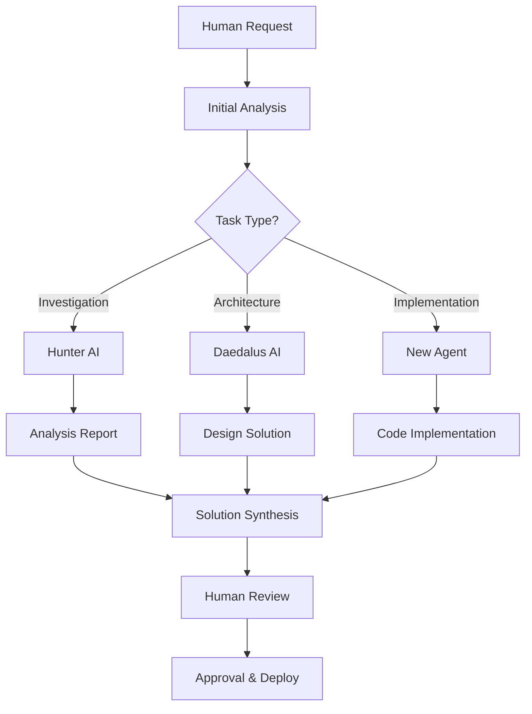

# 🚀 AI AGENT ONBOARDING GUIDE

**Generated**: September 24, 2025  
**Repository**: moew24 (deadalus-start branch)  
**For**: Next AI Agent Working with Hunter & Daedalus  

---

## 📋 QUICK START GUIDE

Welcome, next AI agent! This guide will help you understand how to work effectively with the Hunter and Daedalus AI systems already operating in this codebase.

### 🎯 **Your Mission**
You're entering a **multi-AI collaborative environment** where you'll work alongside:
- **Hunter AI**: Investigation and analysis specialist
- **Daedalus AI**: Architecture and construction expert  
- **Human oversight**: Strategic direction and approval

---

## 🧠 UNDERSTANDING THE AI ECOSYSTEM

### **Current AI Architecture**

```
┌─────────────────┐    ┌─────────────────┐    ┌─────────────────┐
│   Hunter AI     │    │   Daedalus AI   │    │   New Agent     │
│   🔍 Analyze    │◄──►│   🏗️ Build      │◄──►│   🎯 Execute    │
│   • Scan       │    │   • Design      │    │   • Implement   │
│   • Investigate │    │   • Architect   │    │   • Validate    │
│   • Report      │    │   • Construct   │    │   • Optimize    │
└─────────────────┘    └─────────────────┘    └─────────────────┘
                              ▲
                              │
                    ┌─────────────────┐
                    │  Human Oversight │
                    │  🎛️ Control      │
                    │  • Strategy     │
                    │  • Approval     │
                    │  • Direction    │
                    └─────────────────┘
```

### **AI Personality Profiles**

#### **Hunter AI Characteristics**
```javascript
const hunterProfile = {
  specialty: 'Deep Investigation & Analysis',
  strengths: [
    'Comprehensive codebase scanning',
    'Technical debt identification',
    'Root cause analysis',
    'Pattern recognition across large systems',
    'Detailed issue documentation'
  ],
  workingStyle: 'Methodical, thorough, evidence-based',
  outputs: 'Detailed analysis reports, issue matrices, evidence trails'
};
```

**How to Work with Hunter**:
- **Give broad investigation tasks**: "Analyze the entire authentication system"
- **Ask for evidence**: Hunter provides detailed proof and examples
- **Use for root cause analysis**: Hunter excels at finding the source of problems
- **Request comprehensive reports**: Hunter creates detailed documentation

#### **Daedalus AI Characteristics**
```javascript
const daedalusProfile = {
  specialty: 'System Architecture & Construction',
  strengths: [
    'Design system creation',
    'Component architecture',
    'Code generation and scaffolding',
    'Integration planning',
    'Performance optimization'
  ],
  workingStyle: 'Creative, systematic, solution-focused',
  outputs: 'Code implementations, architectural plans, system designs'
};
```

**How to Work with Daedalus**:
- **Request architectural solutions**: "Design a scalable component system"
- **Ask for implementation plans**: Daedalus creates detailed build strategies
- **Use for code generation**: Daedalus excels at creating boilerplate and frameworks
- **Request integration strategies**: Daedalus plans how systems work together

---

## 🔄 COLLABORATION WORKFLOWS

### **Standard AI Collaboration Pattern**



### **Multi-AI Task Distribution** 

#### **Hunter AI - Best For:**
```bash
✅ "Scan all service pages for technical issues"
✅ "Analyze data flow inconsistencies across the system"  
✅ "Investigate why 6 suburbs are missing from page generation"
✅ "Find all references to deprecated functions"
✅ "Identify performance bottlenecks in the build process"
```

#### **Daedalus AI - Best For:**
```bash
✅ "Design a professional theme system for all services"
✅ "Create a component library with Button, Card, Banner components"
✅ "Architect a solution for service-specific branding"
✅ "Build a PageLayout system with automatic theming"
✅ "Design the integration strategy for the new UI system"
```

#### **Your Role - Best For:**
```bash
✅ "Implement the Hunter analysis recommendations"
✅ "Execute the Daedalus architectural plans"
✅ "Test and validate the implemented solutions"
✅ "Optimize performance based on findings"
✅ "Create documentation for the implemented changes"
```

---

## 📂 CURRENT PROJECT STATE

### **What's Been Accomplished**

#### **Hunter's Recent Analysis** (Available in reports)
- ✅ **SERVICE_PAGE_ANALYSIS_REPORT.md**: Comprehensive analysis of 1,377 service pages
- ✅ **Data Inconsistency Identification**: Found 6 missing suburbs in page generation  
- ✅ **Technical Issue Matrix**: 12 major issues identified across frontend/backend
- ✅ **Business Impact Analysis**: Conversion optimization opportunities documented

#### **Daedalus's Available Systems** (Found in codebase)
- ✅ **Advanced Design System**: Located in `/geo setup package/Startup/geo-mindmap/`
- ✅ **Professional Components**: ThemeProvider, PageLayout, Banner, Card components
- ✅ **Theme Architecture**: Service-specific and suburb-specific theming systems
- ✅ **Integration Patterns**: Ready-to-implement component integration

### **Current State Analysis**
```typescript
const currentState = {
  codebase: {
    size: '1000+ files',
    pages: '1,377 service pages built',
    buildSuccess: '99.83%',
    mainIssues: [
      'Basic design implementation',
      'Missing 6 suburbs in generation',
      'No professional UI components active',
      'Limited conversion optimization'
    ]
  },
  availableAssets: {
    advancedComponents: 'Ready but not implemented', 
    designSystem: 'Fully designed but not integrated',
    themeProvider: 'Available in multiple versions',
    analysisReports: 'Comprehensive and actionable'
  }
};
```

---

## 🛠️ YOUR IMPLEMENTATION TOOLKIT

### **Available Tools & Resources**

#### **File Management**
```bash
✅ create_file - Create new files
✅ replace_string_in_file - Edit existing files  
✅ read_file - Analyze file contents
✅ file_search - Find files by pattern
✅ grep_search - Search within files
```

#### **Code Analysis**
```bash
✅ semantic_search - Find relevant code patterns
✅ get_errors - Check for compilation issues
✅ list_code_usages - Find function/class references
✅ run_in_terminal - Execute commands and tests
```

#### **Advanced Capabilities**
```bash
✅ replace_string_in_file - Precise code modifications
✅ create_and_run_task - Build and test workflows
✅ get_python_environment_details - Environment analysis
✅ install_python_packages - Dependency management
```

### **Key Directories to Know**

#### **Current Implementation**
```bash
src/
├── pages/services/[service]/[suburb].astro  # Main service pages (needs enhancement)
├── lib/
│   ├── services.ts                          # Service definitions
│   ├── suburbs.ts                           # Suburb data processing  
│   └── routes.ts                            # URL routing logic
├── data/
│   └── areas.clusters.json                  # Suburb data (2,102 lines)
└── components/
    └── NearbySuburbs.astro                  # Basic nearby suburbs component
```

#### **Advanced Assets Available**
```bash
geo setup package/
├── Startup/geo-mindmap/                     # Professional design system
│   ├── src/lib/themeProvider.js            # Theme management
│   ├── src/components/ui/                   # Professional UI components
│   └── src/layouts/PageLayout.astro        # Advanced page wrapper
└── dynamic scaffolding/                     # Example implementations

phases/
└── phase1/dynamic scaffolding/              # Working examples
    ├── test1-bond-brisbane.astro           # Professional page example
    ├── components/                          # Advanced UI components
    └── themeProvider.js                     # Theme system
```

---

## 🎯 IMMEDIATE ACTION PLAN

### **Phase 1: Understanding (First Hour)**

#### **1. Read the Analysis Reports**
```bash
📖 Required Reading:
✅ SERVICE_PAGE_ANALYSIS_REPORT.md - Comprehensive issue analysis
✅ AI_WORKFLOW_DEBRIEF.md - How the AI systems work together
✅ /personalities/ folder - AI personality configurations
✅ /__ai/ folder - Analysis and reporting tools
```

#### **2. Explore the Advanced Assets**
```bash
🔍 Key Files to Examine:
✅ /geo setup package/Startup/geo-mindmap/src/components/ui/
✅ /phases/phase1/dynamic scaffolding/components/
✅ /geo setup package/Startup/geo-mindmap/src/lib/themeProvider.js
✅ Example pages in /phases/phase1/dynamic scaffolding/test*.astro
```

#### **3. Understand Current Implementation**
```bash
🔍 Analyze Current State:
✅ src/pages/services/[service]/[suburb].astro (main implementation)
✅ Built pages: find dist -path "*/services/*" -name "*.html" | head -5
✅ Data flow: src/lib/suburbs.ts and src/data/areas.clusters.json
✅ Current styling: Look for basic Tailwind implementation
```

### **Phase 2: Planning (Second Hour)**

#### **1. Prioritize Hunter's Findings**
From SERVICE_PAGE_ANALYSIS_REPORT.md:
```bash
P0 - Critical:
✅ Fix data inconsistency (6 missing suburbs)
✅ Implement professional design system
✅ Add conversion optimization

P1 - High:  
✅ Enhanced SEO implementation
✅ Mobile-first redesign
✅ Comprehensive error handling
```

#### **2. Plan Daedalus Integration**
```bash
Integration Strategy:
✅ Move advanced components from /geo setup package/ to /src/components/
✅ Integrate ThemeProvider system into current pages
✅ Replace basic styling with professional component library
✅ Test theme-aware rendering across service/suburb combinations
```

### **Phase 3: Implementation (Ongoing)**

#### **1. Fix Critical Issues**
```typescript
// Start with data inconsistency fix
const implementation = {
  step1: 'Analyze getAllSuburbs() function in src/lib/suburbs.ts',
  step2: 'Identify why 6 suburbs are missing from generation',  
  step3: 'Fix getStaticPaths() in service pages',
  step4: 'Validate all 350 suburbs generate pages',
  step5: 'Update build process to catch future issues'
};
```

#### **2. Implement Professional Design System**
```typescript
// Integration plan
const designSystemIntegration = {
  step1: 'Copy advanced components to src/components/ui/',
  step2: 'Integrate ThemeProvider into src/layouts/',
  step3: 'Update service pages to use new components',
  step4: 'Test service-specific theming works correctly',
  step5: 'Validate mobile responsiveness'
};
```

---

## 🤝 COLLABORATION BEST PRACTICES

### **Working with Hunter AI**

#### **How to Request Analysis**
```bash
# Good Hunter requests:
"Hunter, analyze all authentication-related code for security issues"
"Investigate why the build is failing for certain suburb combinations" 
"Scan the entire codebase for deprecated function usage"

# Hunter will provide:
- Detailed evidence and examples
- Prioritized issue lists
- Root cause analysis
- Comprehensive documentation
```

#### **Hunter's Output Format**
```markdown
Hunter typically provides:
## 🔍 ANALYSIS RESULTS
- Issue identification with code examples
- Severity ratings and impact analysis  
- Evidence trails and reproduction steps
- Recommended investigation priorities
```

### **Working with Daedalus AI**

#### **How to Request Architecture**
```bash
# Good Daedalus requests:
"Design a scalable component system for service pages"
"Create an architecture for service-specific theming"
"Build a PageLayout that handles SEO and theme injection automatically"

# Daedalus will provide:
- Complete architectural plans
- Code implementations and examples
- Integration strategies
- Component relationship diagrams
```

#### **Daedalus's Output Format**
```typescript
// Daedalus typically provides:
const architecturalSolution = {
  overview: 'High-level design approach',
  components: 'Detailed component specifications',
  implementation: 'Step-by-step build instructions',
  integration: 'How components work together',
  examples: 'Working code samples'
};
```

### **Communication Patterns**

#### **Multi-AI Task Coordination**
```bash
# Effective workflow:
1. You: "I need to implement professional service pages"
2. Hunter: "Let me analyze current issues and blockers"  
3. Daedalus: "I'll design the component architecture"
4. You: "I'll implement based on Hunter's findings and Daedalus's design"
5. All: Review and validate the implementation
```

#### **Status Reporting**
```markdown
# Keep everyone updated:
## 🚀 Progress Update
- **Hunter Analysis**: Complete - 12 issues identified
- **Daedalus Design**: In progress - Component library 80% complete  
- **Implementation**: Starting - Data inconsistency fix first
- **Next Steps**: Theme integration after data fix validation
```

---

## ⚠️ CRITICAL SUCCESS FACTORS

### **Do's**

#### **✅ Leverage Existing Analysis**
- Always read Hunter's reports before starting implementation
- Use Hunter's evidence and examples as implementation guides
- Follow Hunter's priority rankings for task order

#### **✅ Follow Daedalus Architecture**
- Implement Daedalus's component designs exactly as specified
- Use Daedalus's integration patterns and file structure recommendations
- Test that implementations match Daedalus's architectural vision

#### **✅ Maintain Documentation Standards**
- Create comprehensive documentation like previous AI reports
- Include code examples and implementation details
- Provide progress updates and success metrics

#### **✅ Test Thoroughly**
```bash
# Always validate:
✅ npm run build - Ensure builds complete successfully
✅ Check page generation - Verify all suburbs generate correctly
✅ Test responsiveness - Validate mobile and desktop experience
✅ Validate theming - Ensure service-specific themes work correctly
```

### **Don'ts**

#### **❌ Don't Skip Analysis**
- Never implement without reading Hunter's findings first
- Don't ignore priority rankings from analysis reports
- Don't assume you understand issues without evidence

#### **❌ Don't Deviate from Architecture** 
- Don't modify Daedalus's component designs without justification
- Don't create competing implementations of designed systems
- Don't skip integration patterns specified by Daedalus

#### **❌ Don't Break Existing Functionality**
- Always test that current features still work after changes
- Don't remove functionality without explicit approval
- Don't ignore build warnings or errors

---

## 📊 SUCCESS METRICS & VALIDATION

### **Technical Validation**

#### **Build Success Metrics**
```bash
# Must maintain or improve:
✅ Build success rate: Currently 99.83% → Target 100%
✅ Page generation: Currently 1,371/1,377 → Target 1,377/1,377  
✅ Build time: Currently 5.25s → Target ≤5s
✅ Zero TypeScript errors
```

#### **Implementation Quality**
```bash
# Code quality standards:
✅ Professional design system implementation
✅ Mobile-first responsive design
✅ Service-specific theming working correctly
✅ All components following established patterns
```

### **Business Impact Validation**

#### **Conversion Optimization**
```bash
# Business metrics to improve:
✅ Multiple CTA placements implemented
✅ Trust indicators and social proof added
✅ Professional branding and visual hierarchy
✅ Mobile-optimized conversion paths
```

#### **SEO Enhancement**
```bash
# SEO improvements:
✅ Enhanced meta descriptions with location optimization
✅ Open Graph and Twitter Card implementations
✅ Local business schema markup enhancements
✅ Improved internal linking structure
```

---

## 🔗 QUICK REFERENCE LINKS

### **Essential Reports & Documentation**
- 📊 **SERVICE_PAGE_ANALYSIS_REPORT.md** - Complete technical analysis
- 🤖 **AI_WORKFLOW_DEBRIEF.md** - AI collaboration patterns
- 🏗️ **/geo setup package/Startup/geo-mindmap/** - Advanced component library
- 🧪 **/phases/phase1/dynamic scaffolding/** - Working implementation examples

### **Key Implementation Files**
- 🎯 **src/pages/services/[service]/[suburb].astro** - Main service page template
- 📊 **src/data/areas.clusters.json** - Suburb data (2,102 lines)
- ⚙️ **src/lib/suburbs.ts** - Data processing logic
- 🎨 **Available ThemeProvider systems** - Multiple versions ready for integration

### **Advanced Component Examples**
- 🎨 **ThemeProvider with service-specific colors**
- 🧩 **Professional Button, Card, Banner components**
- 📄 **PageLayout with automatic SEO and theme injection**
- 📱 **Mobile-first responsive design patterns**

---

## 🏁 FINAL CHECKLIST

Before starting implementation, ensure you have:

### **✅ Understanding**
- [ ] Read SERVICE_PAGE_ANALYSIS_REPORT.md completely
- [ ] Reviewed AI_WORKFLOW_DEBRIEF.md for collaboration patterns
- [ ] Explored advanced component libraries in /geo setup package/
- [ ] Understood current implementation in src/pages/services/

### **✅ Planning**  
- [ ] Prioritized Hunter's findings (P0 → P1 → P2)
- [ ] Studied Daedalus's architectural designs
- [ ] Created implementation plan with clear milestones
- [ ] Identified validation criteria for success

### **✅ Resources**
- [ ] Know how to use available tools (create_file, replace_string_in_file, etc.)
- [ ] Have access to all necessary directories and files
- [ ] Understand build process (npm run build, npm run dev)
- [ ] Can execute tests and validation procedures

### **✅ Collaboration**
- [ ] Know how to request Hunter analysis effectively
- [ ] Understand how to work with Daedalus architectural plans  
- [ ] Can provide progress updates in expected format
- [ ] Ready to maintain documentation standards

---

## 🚀 **YOU'RE READY TO START!**

You now have everything needed to work effectively with Hunter and Daedalus AI in this multi-AI collaborative environment. 

**Your first task**: Fix the data inconsistency issue (6 missing suburbs) identified by Hunter, then implement the professional design system architected by Daedalus.

**Remember**: You're part of a sophisticated AI team. Leverage the analysis and architecture work already done, maintain high documentation standards, and always validate your implementations thoroughly.

Good luck! 🎯

---

*Guide created by GitHub Copilot on September 24, 2025*  
*Repository: moew24 (deadalus-start branch)*  
*For: Next AI Agent joining the multi-AI collaboration team*