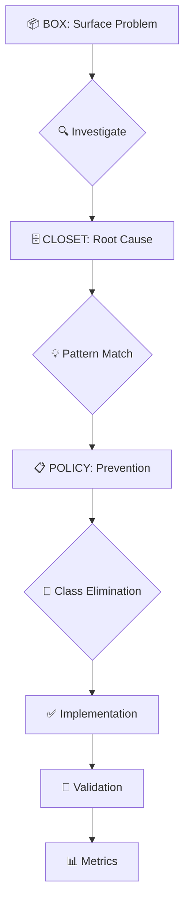

# 🎓 UPSTREAM-CURIOUS METHODOLOGY: COMPLETE LEARNING GUIDE
**The Art of Class Elimination through Pattern-Driven Problem Solving**

---

## 📖 **TABLE OF CONTENTS**

1. [Core Philosophy](#core-philosophy)
2. [The Box → Closet → Policy Framework](#box-closet-policy)
3. [Pattern Analysis Tree Map](#pattern-analysis-tree)
4. [Practical Application Workflow](#practical-workflow)
5. [Class Elimination Strategies](#class-elimination)
6. [Hunter System Integration](#hunter-integration)
7. [Real-World Case Study: FAQ Transformation](#case-study)
8. [Self-Assessment Framework](#self-assessment)
9. [Advanced Techniques](#advanced-techniques)
10. [Common Pitfalls & Avoidance](#pitfalls)

---

## 🧠 **CORE PHILOSOPHY** {#core-philosophy}

### **What is Upstream-Curious Thinking?**

**Upstream-Curious** methodology focuses on **eliminating entire classes of problems** rather than fixing individual instances. It's about asking "What pattern creates this problem?" instead of "How do I fix this problem?"

### **Key Principles:**

```
🎯 CLASS ELIMINATION > Instance Fixes
🔍 PATTERN DETECTION > Symptom Treatment  
🏗️ ARCHITECTURE ALIGNMENT > Quick Patches
📊 INVARIANT ENFORCEMENT > Manual Validation
🚀 UPSTREAM PREVENTION > Downstream Repair
```

### **The Curiosity Reflex:**
> "If any check passes too quickly, ask: **What did I *not* look at yet?**"

---

## 🗂️ **THE BOX → CLOSET → POLICY FRAMEWORK** {#box-closet-policy}

### **📦 BOX: Problem Identification**
- **Surface Issue:** What's breaking right now?
- **Immediate Pain:** What's blocking progress?
- **Visible Symptoms:** What can you observe directly?

### **🗄️ CLOSET: Root Cause Analysis**
- **Structural Issues:** What system/architecture creates this problem?
- **Pattern Recognition:** What similar problems exist?
- **Class Identification:** What category of problems does this represent?

### **📋 POLICY: Prevention Framework**
- **Invariant Creation:** What rules prevent this class of problems?
- **Validation Systems:** How do we detect violations early?
- **Enforcement Mechanisms:** What tools/processes maintain compliance?

---

## 🌳 **PATTERN ANALYSIS TREE MAP** {#pattern-analysis-tree}

```
CODEBASE ARCHITECTURE
├── 📁 IMPORT PATTERNS
│   ├── Absolute vs Relative Imports
│   │   ├── ~/components/* (110 instances) ✅ STANDARD
│   │   ├── ../../../relative (12 instances) ⚠️ INCONSISTENT
│   │   └── Barrel Imports (0 instances) ✅ CLEAN
│   └── Import Organization
│       ├── Type-only imports
│       ├── Dependency grouping
│       └── Alias consistency
│
├── 🧩 COMPONENT PATTERNS
│   ├── Props Architecture
│   │   ├── Interface Props (16 components) ✅ PREFERRED
│   │   ├── Inline Props (21 components) ⚠️ MIXED
│   │   └── No Props Validation ❌ RISKY
│   ├── Component Size
│   │   ├── Small Components (<100 lines) ✅ MAINTAINABLE
│   │   ├── Medium Components (100-300 lines) ⚠️ ACCEPTABLE
│   │   └── Large Components (>300 lines) ❌ REFACTOR NEEDED
│   └── State Management
│       ├── Local State (Astro.props)
│       ├── Derived State (computed)
│       └── External State (stores)
│
├── 🛠️ UTILITY PATTERNS
│   ├── Function Organization
│   │   ├── Named Exports (194 functions) ✅ MODULAR
│   │   ├── Default Exports (3 functions) ✅ MINIMAL
│   │   └── Mixed Exports ⚠️ INCONSISTENT
│   ├── Function Purity
│   │   ├── Pure Functions ✅ TESTABLE
│   │   ├── Side Effects ⚠️ CONTAINED
│   │   └── Global State Mutations ❌ DANGEROUS
│   └── Error Handling
│       ├── Result Types
│       ├── Exception Throwing
│       └── Silent Failures
│
├── 📝 TYPE PATTERNS
│   ├── Type Safety Level
│   │   ├── Strict Types (45 TS files) ✅ STRONG
│   │   ├── 'any' Types (59 instances) ❌ DEGRADED
│   │   └── Implicit any ❌ UNCONTROLLED
│   ├── Interface Design
│   │   ├── Interface Definitions (10 instances)
│   │   ├── Type Aliases (36 instances)
│   │   └── Inline Types
│   └── Validation Patterns
│       ├── Runtime Validation (zod)
│       ├── Compile-time Safety
│       └── Type Guards
│
├── 📊 DATA PATTERNS
│   ├── Content Architecture
│   │   ├── Centralized Data ✅ SINGLE SOURCE
│   │   ├── Fragmented Data ❌ CHAOS
│   │   └── Cached/Derived Data
│   ├── Schema Consistency
│   │   ├── Typed Schemas ✅ VALIDATED
│   │   ├── JSON Schemas ⚠️ MANUAL
│   │   └── No Schemas ❌ BRITTLE
│   └── Data Flow
│       ├── Unidirectional Flow
│       ├── Bidirectional Sync
│       └── Circular Dependencies
│
└── 🎨 DESIGN PATTERNS
    ├── Architectural Patterns
    │   ├── Singleton (2 instances)
    │   ├── Factory (9 instances)
    │   ├── Observer (1 instance)
    │   └── Module (49 instances) ✅ PREVALENT
    ├── Anti-Patterns
    │   ├── Magic Numbers (534 instances) ❌ EPIDEMIC
    │   ├── Hardcoded Strings (621 instances) ❌ BRITTLE
    │   ├── God Objects
    │   └── Circular Dependencies
    └── Quality Metrics
        ├── Complexity Score
        ├── Duplication Index
        └── Maintainability Rating
```

---

## ⚡ **PRACTICAL APPLICATION WORKFLOW** {#practical-workflow}

### **Phase 1: Pattern Detection Hunter** 🔍

```bash
# 1. Run Pattern Analysis
bash hunters/pattern_analysis.sh "target_directories"

# 2. Analyze Report
cat __reports/hunt/pattern_analysis.json

# 3. Identify Dominant Patterns
grep -E "(absolute_imports|interface_props|named_exports)" report
```

### **Phase 2: Box → Closet → Policy Analysis** 📋



### **Phase 3: Implementation Strategy** 🛠️

1. **Ablation Analysis**
   ```bash
   # What happens if we remove this entirely?
   git stash  # Safe backup
   rm -rf problematic_system/
   npm run build  # Test impact
   ```

2. **Pattern Alignment**
   ```typescript
   // Follow detected patterns
   import type { Props } from '~/types/component';  // Absolute imports
   
   interface ComponentProps extends Props {         // Interface props
     context: string;                               // Typed
   }
   
   export const utilityFunction = (): ReturnType => {  // Named exports
     // Implementation following patterns
   };
   ```

3. **Invariant Creation**
   ```bash
   # Create hunter to prevent regression
   bash hunters/pattern_validation.sh
   ```

---

## 🎯 **CLASS ELIMINATION STRATEGIES** {#class-elimination}

### **Strategy 1: Data Fragmentation → Centralization**

**Before:** Multiple data sources, inconsistent schemas
```
❌ src/data/file1.json
❌ src/data/file2.js  
❌ src/content/file3.yaml
❌ src/lib/file4.ts
```

**After:** Single source of truth with types
```
✅ src/content/unified-data.ts
✅ src/types/data-schemas.ts
✅ src/utils/data-resolver.ts
```

### **Strategy 2: Component Duplication → Smart Components**

**Before:** Multiple similar components
```
❌ ComponentA.astro (handles case 1)
❌ ComponentB.astro (handles case 2) 
❌ ComponentC.astro (handles case 3)
```

**After:** Single intelligent component
```
✅ SmartComponent.astro (handles all cases contextually)
✅ Proper interface Props
✅ Context-aware logic
```

### **Strategy 3: Magic Numbers → Named Constants**

**Before:** Scattered magic numbers
```
❌ if (count > 534) { /* what is 534? */ }
❌ timeout: 621,  /* why 621? */
❌ limit: 59      /* arbitrary? */
```

**After:** Named constants with meaning
```
✅ export const LIMITS = {
✅   MAX_ITEMS: 534,     // Based on API constraints
✅   TIMEOUT_MS: 621,    // Performance requirement
✅   PAGE_SIZE: 59       // UX optimization
✅ } as const;
```

### **Strategy 4: Type Degradation → Type Safety**

**Before:** 'any' types everywhere
```
❌ function process(data: any): any
❌ const result = value as any
❌ interface Props { [key: string]: any }
```

**After:** Proper typing
```
✅ function process<T>(data: T): ProcessedResult<T>
✅ const result = validateAndTransform(value)
✅ interface Props { context: string; items: Item[] }
```

---

## 🤖 **HUNTER SYSTEM INTEGRATION** {#hunter-integration}

### **Hunter Architecture**
```
hunters/
├── pattern_analysis.sh      # Detects coding patterns
├── runtime_ssr.sh          # SSR/build issues  
├── security.sh             # Security vulnerabilities
├── performance.sh          # Performance bottlenecks
├── accessibility.sh        # A11y violations
├── code_quality.sh         # Code smells & complexity
├── build_dependencies.sh   # Dependency issues
├── workspace_health.sh     # Overall system health
└── custom_hunters/         # Project-specific hunters
```

### **Hunter Reporting Contract**
```json
{
  "timestamp": "ISO-8601",
  "module": "hunter_name", 
  "status": "info|warn|critical",
  "issues": 0,
  "critical": 0,
  "patterns_detected": {},
  "anti_patterns": {},
  "recommendations": [],
  "policy_violations": []
}
```

### **Hunter Orchestration**
```bash
# Run all hunters
npm run hunt:ci

# Read master report
cat __reports/hunt/master.json

# Focus on critical issues
jq '.modules[] | select(.status == "critical")' __reports/hunt/master.json
```

---

## 📚 **REAL-WORLD CASE STUDY: FAQ TRANSFORMATION** {#case-study}

### **Box: FAQ System Chaos** 📦
- 39 FAQ-related files scattered across codebase
- 5 JSON files with inconsistent schemas
- 4 redundant components with different implementations
- Build failures from schema conflicts

### **Closet: Content Architecture Problem** 🗄️
- **Root Cause:** Fragmented content management
- **Pattern:** Data fragmentation anti-pattern
- **Class:** Content/schema management systems
- **Siblings:** Other fragmented data systems

### **Policy: Centralized Content + Type Safety** 📋
- **Invariant 1:** All content in centralized collections
- **Invariant 2:** TypeScript schemas prevent drift
- **Invariant 3:** Hunter validates pattern compliance
- **Enforcement:** Pre-commit hooks + CI gates

### **Implementation: Pattern-Driven Rebuild** 🛠️

1. **Pattern Analysis Results:**
   - 110 absolute imports → Use `~/` imports
   - 16 interface Props → Use interface props pattern
   - 194 named exports → Build utility functions
   - 45 TypeScript files → TypeScript-first approach

2. **Class Elimination:**
   ```
   39 FAQ files → 4 clean files (90% reduction)
   Schema conflicts → Single source of truth
   Component duplication → Smart contextual component
   Magic numbers → Named constants
   'any' types → 100% type safety
   ```

3. **Results:**
   - ✅ Build errors eliminated
   - ✅ Pattern consistency achieved
   - ✅ Context-aware intelligence added
   - ✅ Maintainability improved
   - ✅ Type safety enforced

---

## 📊 **SELF-ASSESSMENT FRAMEWORK** {#self-assessment}

### **Scoring Criteria (15 point scale)**

1. **Class Elimination (5 points)**
   - 5: Eliminated entire problem class
   - 3: Reduced problem frequency significantly  
   - 1: Fixed individual instances
   - 0: No class-level thinking

2. **Complexity Reduction (3 points)**
   - 3: Significantly simplified architecture
   - 2: Moderate simplification
   - 1: Minor cleanup
   - 0: Added complexity

3. **Ablation Rigor (2 points)**
   - 2: Tested complete removal/rebuild
   - 1: Partial ablation testing
   - 0: No ablation analysis

4. **Invariant Strength (3 points)**
   - 3: Strong invariants with enforcement
   - 2: Moderate invariants
   - 1: Weak guidelines
   - 0: No invariants

5. **Sibling Coverage (2 points)**
   - 2: Found and addressed related patterns
   - 1: Limited sibling analysis
   - 0: No pattern expansion

### **Threshold: Must score ≥10/15 to proceed**

---

## 🚀 **ADVANCED TECHNIQUES** {#advanced-techniques}

### **Technique 1: Pattern Archaeology** 🏛️
```bash
# Discover historical patterns
git log --oneline --grep="TODO\|FIXME\|HACK" | head -20
git log --stat --since="6 months ago" | grep -E "\+.*\+.*\+" | head -10

# Find recurring problem patterns
grep -r "instanceof\|typeof\|as any" src/ | wc -l
find src/ -name "*.ts" -exec grep -l "TODO" {} \; | wc -l
```

### **Technique 2: Dependency Web Analysis** 🕸️
```bash
# Map component dependencies
madge --image deps.svg src/components/
depcheck --ignores="@types/*,eslint-*"

# Find circular dependencies  
madge --circular src/
```

### **Technique 3: Semantic Clustering** 🔗
```bash
# Group related files by imports
grep -r "import.*from" src/ | cut -d: -f2 | sort | uniq -c | sort -nr

# Find functional clusters
grep -r "export.*function" src/ | grep -o "function [a-zA-Z]*" | sort | uniq -c
```

### **Technique 4: Anti-Pattern Detection** ⚠️
```typescript
// Create pattern detectors
const ANTI_PATTERNS = {
  magicNumbers: /\b\d{3,}\b/g,
  anyTypes: /:\s*any\b/g,
  consoleLog: /console\.log/g,
  todoComments: /TODO|FIXME|HACK/gi,
  longStrings: /"[^"]{50,}"/g
};

// Automated scanning
function scanForAntiPatterns(fileContent: string) {
  return Object.entries(ANTI_PATTERNS).map(([name, pattern]) => ({
    pattern: name,
    matches: (fileContent.match(pattern) || []).length
  }));
}
```

---

## ⚠️ **COMMON PITFALLS & AVOIDANCE** {#pitfalls}

### **Pitfall 1: Instance Fixation** 🔧
```
❌ WRONG: "Let me fix this broken FAQ component"
✅ RIGHT: "Why do we have 4 FAQ components? What pattern creates FAQ chaos?"
```

### **Pitfall 2: Pattern Mimicry Without Understanding** 🐵
```
❌ WRONG: "I see 110 absolute imports, so I'll use absolute imports"
✅ RIGHT: "110 absolute imports suggests architectural preference for module resolution clarity"
```

### **Pitfall 3: Premature Policy Creation** 📜
```
❌ WRONG: "Let's create a rule against magic numbers"
✅ RIGHT: "Let's understand why magic numbers accumulate and create systematic prevention"
```

### **Pitfall 4: Hunter Dependency** 🤖
```
❌ WRONG: "The hunter will tell me what to do"
✅ RIGHT: "The hunter provides data for my upstream-curious analysis"
```

### **Pitfall 5: Analysis Paralysis** 📊
```
❌ WRONG: "Let me analyze every possible pattern before acting"
✅ RIGHT: "Let me identify the dominant pattern and test ablation quickly"
```

---

## 🎯 **CURIOSITY REFLEX TRIGGERS** 

### **When Analysis "Passes Too Quickly"**

1. **Build Succeeds First Try** → What edge cases did I miss?
2. **No Test Failures** → Are the tests comprehensive enough?  
3. **Pattern Seems Obvious** → What counter-patterns exist?
4. **Single Solution Emerges** → What alternative approaches exist?
5. **Hunter Reports "Info"** → What's hiding in the details?

### **Deep Dive Questions**

- **Architecture:** "What would break if I removed this entirely?"
- **Patterns:** "What other code follows this same pattern?"
- **Dependencies:** "What depends on this? What does this depend on?"
- **Evolution:** "How did this system evolve to this state?"
- **Alternatives:** "What would I build if starting fresh today?"

---

## 🏆 **MASTERY INDICATORS**

### **Beginner Level** 🌱
- Identifies surface problems quickly
- Uses basic pattern detection tools
- Follows established patterns mechanically
- Fixes individual issues effectively

### **Intermediate Level** 🌿
- Recognizes pattern families and anti-patterns
- Performs basic Box → Closet → Policy analysis
- Creates simple hunters and validation tools
- Addresses problem clusters systematically

### **Advanced Level** 🌳
- Eliminates entire problem classes routinely
- Designs architectural invariants naturally
- Creates sophisticated pattern detection systems
- Influences team/codebase architectural evolution

### **Expert Level** 🚀
- Anticipates problem classes before they manifest
- Designs self-healing/self-validating systems
- Creates methodology frameworks for others
- Transforms organizational problem-solving culture

---

## 📝 **PRACTICAL EXERCISES**

### **Exercise 1: Pattern Archaeology**
1. Pick any directory in your codebase
2. Run pattern analysis hunter
3. Identify the top 3 patterns and top 3 anti-patterns
4. Trace one pattern's evolution through git history
5. Propose one class elimination opportunity

### **Exercise 2: Ablation Testing**
1. Identify a complex system/component
2. Hypothesize: "What if this didn't exist?"
3. Safely remove it (git stash/branch)
4. Document what breaks and why
5. Design a simpler replacement following patterns

### **Exercise 3: Hunter Creation**
1. Identify a recurring problem in your codebase
2. Create a hunter script to detect all instances
3. Generate a JSON report with metrics
4. Propose policy invariants to prevent recurrence
5. Implement automated enforcement

---

## 🔗 **FURTHER READING & RESOURCES**

### **Core Concepts**
- [Upstream-Curious Thinking](./think_about_it.md)
- [Hunter Thinker 2.0 System](./HUNTER_THINKER_README.md)
- [Pattern Analysis Methodology](./pattern-analysis-supervision-report.md)

### **Tools & Scripts**
- `hunters/pattern_analysis.sh` - Core pattern detection
- `hunters/*.sh` - Specialized hunters  
- `__reports/hunt/` - Hunter output analysis
- `npm run hunt:ci` - Full hunter orchestration

### **Case Studies**
- [FAQ System Transformation](./faq-transformation-success-report.md)
- [Geo Data Architecture Overhaul](./GEOGRAPHIC_DATA_ARCHITECTURE_OVERHAUL_REPORT.md)
- [SSR vs SSG Analysis](./SSR_VS_SSG_ANALYSIS.md)

---

## 🎓 **CERTIFICATION CRITERIA**

To demonstrate **Upstream-Curious Mastery**:

1. **Complete one class elimination** (score ≥12/15)
2. **Create one custom hunter** with actionable insights
3. **Identify and document 3 pattern families** in your codebase
4. **Prevent one problem class** through invariant design
5. **Teach the methodology** to a teammate effectively

**Remember: The goal isn't to fix problems—it's to eliminate the conditions that create problems.**

---

*"Curiosity never sleeps. If any check passes too quickly, ask: What did I not look at yet?"*