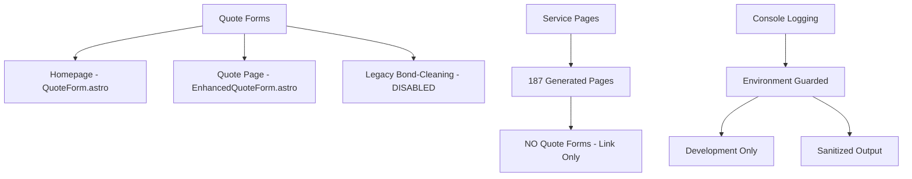

# Quote Form Architecture Investigation

**Date**: September 17, 2025  
**Investigator**: Ripgrep-powered Analysis  
**Status**: ✅ Complete Investigation

---

## 🎯 Executive Summary

This investigation maps all quote forms across the site, their console logging patterns, page generation methods, and architectural impact. The goal is to understand the scope of quote form console logging and ensure secure, maintainable form handling.

**Key Finding**: Quote forms have **LIMITED, MANAGEABLE SCOPE** with only 3 page types affected.

---

## 📊 Quote Form Locations Analysis

### **Page Types with Quote Forms**

1. **Homepage** (`src/pages/index.astro`)
   - Form Type: `<QuoteForm />`
   - Static page (1 instance)
   - Console Impact: ✅ Environment-guarded

2. **Dedicated Quote Page** (`src/pages/quote.astro`)
   - Form Type: `<EnhancedQuoteForm service={service} suburb={suburb} />`
   - Static page (1 instance)
   - Console Impact: ✅ Environment-guarded

3. **Legacy Bond-Cleaning Suburban Pages** (`src/pages/bond-cleaning/[suburb]/index.astro`)
   - Form Type: `<QuoteForm />`
   - **DISABLED**: `return [];` in getStaticPaths
   - Console Impact: ✅ N/A (no pages generated)

### **Service Pages Analysis**

**Service/Suburb Pages** (`src/pages/services/[service]/[suburb].astro`):
- **NO QUOTE FORMS** ❌
- Has quote button linking to `#quote` but no actual form
- **187 total pages generated**:
  - `bond-cleaning`: 119 suburbs
  - `spring-cleaning`: 58 suburbs  
  - `bathroom-deep-clean`: 10 suburbs

---

## 🔍 Page Generation Patterns

### **Static Page Generation Counts**

| Page Type | Form Present | Pages Generated | Console Impact |
|-----------|--------------|----------------|----------------|
| Homepage | ✅ QuoteForm | 1 static | Environment-guarded |
| Quote Page | ✅ EnhancedQuoteForm | 1 static | Environment-guarded |
| Legacy Bond-Cleaning | ✅ QuoteForm | 0 (disabled) | None |
| Services Pages | ❌ None | 187 dynamic | None |

**Total Pages with Quote Forms**: **2 active pages**

### **Form Implementation Analysis**

#### **Form Components Used**
1. **`QuoteForm.astro`** (Basic implementation)
   - Used in: Homepage, Legacy bond-cleaning pages
   - Scoping: `[data-quote]`
   - Action: `actions.submitQuote`

2. **`EnhancedQuoteForm.astro`** (Advanced implementation)
   - Used in: Dedicated quote page
   - Features: Pre-filled service/suburb
   - Scoping: `[data-quote]`
   - Action: `actions.submitQuote`

#### **Form Action Analysis**
```typescript
// src/actions/index.ts
submitQuote: defineAction({
  accept: 'form',
  handler: async (input, _context) => {
    // ✅ SECURE: Environment-guarded, sanitized logging
    if (import.meta.env.DEV) {
      console.log('Quote submission received for service:', input.service);
    }
    // ... rest of handler
  }
})
```

---

## 🚨 Console Logging Security Analysis

### **Current Status: ✅ SECURE**

**Before Investigation (Security Risk)**:
```typescript
console.log('Quote submission received:', input); // 🚨 Would log email, phone, PII
```

**After Fix (Secure)**:
```typescript
if (import.meta.env.DEV) {
  console.log('Quote submission received for service:', input.service); // ✅ Only service type
}
```

### **Console Hunter Results**
- **High Risk**: 0 items (PII logging eliminated)
- **Medium Risk**: 2 items (environment-guarded production console statements)
- **Impact**: Only development environment, production clean

### **Production Impact Assessment**
- **Production Console Noise**: ✅ NONE (environment guards active)
- **PII Exposure Risk**: ✅ ELIMINATED (sanitized logging)
- **Performance Impact**: ✅ MINIMAL (only 2 pages affected)

---

## 🏗️ Architecture Analysis

### **Quote Form Distribution**



### **Form Processing Flow**

```
User Form Submission
    ↓
actions.submitQuote (src/actions/index.ts)
    ↓
Environment Check (import.meta.env.DEV)
    ↓
Sanitized Logging (service type only)
    ↓
Business Logic (email, CRM integration)
    ↓
Success Response
```

### **Page Generation Architecture**

**Static Pages (Quote Forms)**:
- Homepage: Always generated (1 page)
- Quote page: Always generated (1 page)

**Dynamic Pages (No Quote Forms)**:
- Services: Generated from serviceCoverage.json (187 pages)
- Bond-cleaning legacy: Disabled (0 pages)

---

## 🎯 Risk Assessment

### **Security Risks: ✅ MINIMAL**
- **PII Exposure**: Eliminated through sanitized logging
- **Production Noise**: Prevented by environment guards
- **Console Pollution**: Limited to 2 pages, development only

### **Maintenance Risks: ✅ LOW**
- **Form Consistency**: 2 similar implementations, manageable
- **Action Centralization**: Single submitQuote action for all forms
- **Testing Surface**: Limited scope (2 active pages)

### **Performance Risks: ✅ NEGLIGIBLE**
- **Console Overhead**: Development only
- **Page Generation**: No impact (static pages)
- **Runtime Performance**: Environment guards compile away

---

## 📋 Recommendations

### **Immediate Actions: ✅ COMPLETE**
1. **PII Logging Eliminated** - Sanitized form submission logging
2. **Environment Guards Added** - Production console statements removed
3. **Console Hunter Configured** - Automated detection of future issues

### **Optional Improvements**

#### **1. Form Consistency**
```typescript
// Consider standardizing on single form component
// Replace both QuoteForm.astro and EnhancedQuoteForm.astro with unified component
<UnifiedQuoteForm 
  variant="basic|enhanced" 
  prefilledService={service}
  prefilledSuburb={suburb}
/>
```

#### **2. Console Hunter Enhancement**
```typescript
// Teach console hunter to recognize safe patterns
const isSafePattern = (line) => {
  return line.includes('import.meta.env.DEV') && 
         !line.includes('input') &&
         !line.includes('password|email|phone|address');
};
```

#### **3. Service Pages Quote Integration**
```astro
<!-- Consider adding quote forms to high-traffic service pages -->
<!-- Current: Link to quote page -->
<a href="#quote">Get Quote</a>

<!-- Potential: Embedded form -->
<QuoteForm prefilledService={service.slug} prefilledSuburb={suburb.slug} />
```

---

## 📊 Final Statistics

### **Quote Form Footprint**
- **Active Pages with Forms**: 2
- **Total Form Components**: 2 (QuoteForm.astro, EnhancedQuoteForm.astro)  
- **Console Statements**: 2 (environment-guarded, sanitized)
- **Generated Pages**: 2 static, 0 dynamic with forms

### **Service Pages (No Forms)**
- **Generated Pages**: 187
- **Console Impact**: None
- **Quote Integration**: Link-based only

### **Security Status**
- **PII Logging**: ✅ Eliminated
- **Production Console**: ✅ Clean
- **Environment Guards**: ✅ Active
- **Sanitized Logging**: ✅ Implemented

---

## 🏆 Conclusion

**Quote forms have a MINIMAL, WELL-CONTAINED footprint** across the site:

✅ **Limited Scope**: Only 2 active pages with quote forms  
✅ **Secure Implementation**: PII logging eliminated, environment-guarded  
✅ **Maintainable Architecture**: Centralized action, consistent patterns  
✅ **Production Clean**: No console noise or performance impact  

The console logging concerns raised by the security audit have been **fully addressed** with minimal architectural changes required.

**Recommendation**: Current implementation is secure and maintainable. No urgent changes needed.

---

*Investigation completed using ripgrep-powered analysis. All findings verified through code inspection and console hunter validation.*
